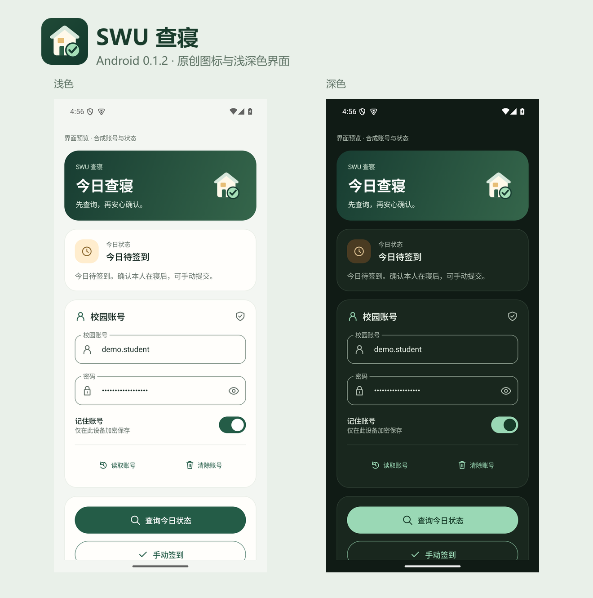

# Android 视觉资源

应用标志与界面线条图标为本项目原创，使用项目 MIT 许可。

- `swu-checkin-icon.svg` 是可编辑的矢量预览：深绿底色、暖白宿舍、灯光与确认标记。
- 安装包使用 `app/src/main/res/` 中的原生 VectorDrawable，不加载网络图片或增加图标依赖。
- Android 24/25 使用放大的常规/圆形图标；Android 26+ 使用自适应图标；Android 33+ 提供单色主题图标。
- 图标中的宿舍是通用住宅符号，不使用学校校徽，也不表示学校官方应用。
- `DesignPreviewActivity` 仅存在于 debug 包，以合成账号和状态显示共用组件，不调用控制器或网络；正式包保留账号页防截屏保护。

## 实际模拟器预览

原始截图为 API35 / 4 KB / 1080×2400 模拟器，带“界面预览 · 合成账号与状态”标识；图片来自共用界面组件的实际渲染，不是效果稿。另见 [1.5 倍字号](previews/large-text.png)。
